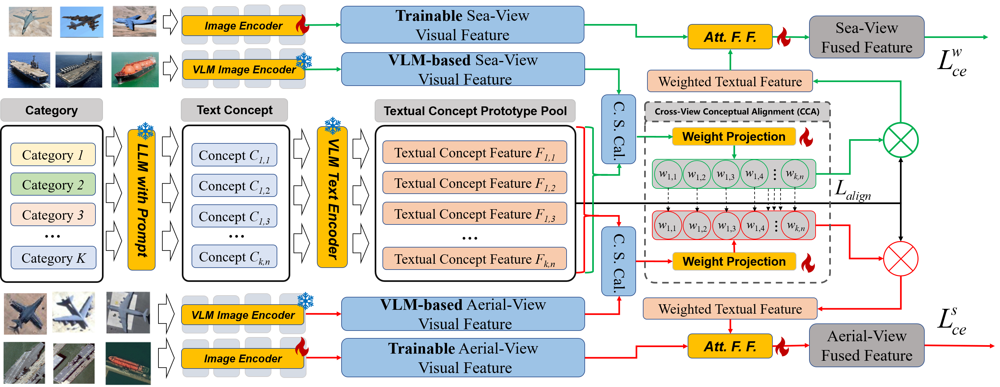

# Web2Sky: Enhancing Fine-Grained Aerial View Target Recognition via Cross-View Conceptual Alignment
The benchmark and dataset of the thesis "Web2Sky: Enhancing Fine-Grained Aerial View Target Recognition via Cross-View Conceptual Alignment"

## Background:

Limited spatial resolution of aerial-view images systematically restricts fine-grained target recognition in earth observation systems. While Cross-view Visual Alignment (CVA) augments aerial-view data with auxiliary visual inputs (e.g., web-sourced imagery), its reliance on pixel-level correspondence fails to address the semantic gap between ground and aerial/satellite views. We identify two inherent limitations: (1) visual geometric differences that frustrates target semantic consistency representation, and (2) background-induced feature entanglement that reduces discriminability. In this work, we propose Cross-view Conceptual Alignment (CCA), a vision-language framework that shifts cross-view learning from pixel-level feature matching to concept-driven semantic transplantation. By encoding each category as several view-invariant conceptual prototypes and distilling cross-view activation vectors based on their alignment with these prototypes, CCA suppresses misalignment caused by geometric variance and background entanglement, enabling robust semantic transfer. Extensive experiments on Web2Sky, a novel fine-grained RS target recognition benchmark with more than 20,000 images constructed by us, demonstrate that CCA achieves state-of-the-art performance.

## Contribution:

1. We propose a textual concept-based cross-view alignment framework called CCA, which leverages VLMs' multimodal alignment capability to overcome limitations, including the cross-view semantic gap and non-target semantic interference of conventional visual-based feature alignment.
2. We explore the potential cross-view knowledge-transfer advantages of the CBMs. By designing a shared textual-concept feature prototype pool based on VLMs and aligning the activation vectors of cross-view images towards the prototype pool, we achieve effective knowledge transfer.
3. We propose a novel activation weights generation strategy based on prior distribution sampling, which is more suitable for CCA scenarios. This strategy samples weights from a prior mixed Dirichlet distribution to overcome the phenomenon of excessive information suppression during the conventional weight generation based on softmax function.
4. We construct the first Web to aerial-view cross-view target fine-grained recognition benchmark (Web2Sky) to support the community's exploration of this new task. The dataset covers multiple fine-grained categories in the two major categories of aircraft and ships, and high-quality web-source images are collected and cleaned, with tens of thousands of images summarized.

## Web2Sky Benchmark:

The complete benchmark will be released later. You can have priority access to the Ship Dataset Track in the Web2Sky dataset.

**Web2Sky ship Track:**  https://pan.baidu.com/s/1a49zhHnAoYwjAEubYsDiHg?pwd=9qg9

## Cross-view Visual Alignment (CVA):

